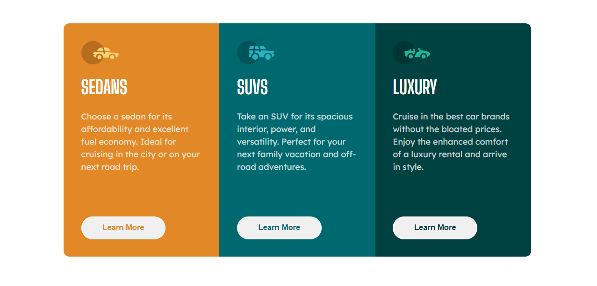

# Frontend Mentor - 3-column preview card component solution

This is a solution to the [3-column preview card component challenge on Frontend Mentor](https://www.frontendmentor.io/challenges/3column-preview-card-component-pH92eAR2-). Frontend Mentor challenges help you improve your coding skills by building realistic projects.

## Table of contents

-   [Overview](#overview)
    -   [The challenge](#the-challenge)
    -   [Screenshot](#screenshot)
    -   [Links](#links)
-   [My process](#my-process)
    -   [Built with](#built-with)
-   [Author](#author)

## Overview

### The challenge

Users should be able to:

-   View the optimal layout depending on their device's screen size
-   See hover states for interactive elements

### Screenshot

### Links

-   Solution URL: [Solution URL](https://www.frontendmentor.io/challenges/stats-preview-card-component-8JqbgoU62/hub)
-   Live Site URL: [Live Site](https://jp-stats-preview-card-component.netlify.app/)

## My process

### Built with

-   Semantic HTML5 markup
-   CSS custom properties
-   Flexbox
-   Mobile-first workflow
-   [Styled Components](https://styled-components.com/) - For styles

## Author

-   Website - [João P. Kiyoshi](https://joaopkiyoshi.netlify.app/)
-   Frontend Mentor - [@jpkiyoshi](https://www.frontendmentor.io/profile/jpkiyoshi)
-   Twitter - [@jpkiyoshi](https://twitter.com/jpkiyoshi)
